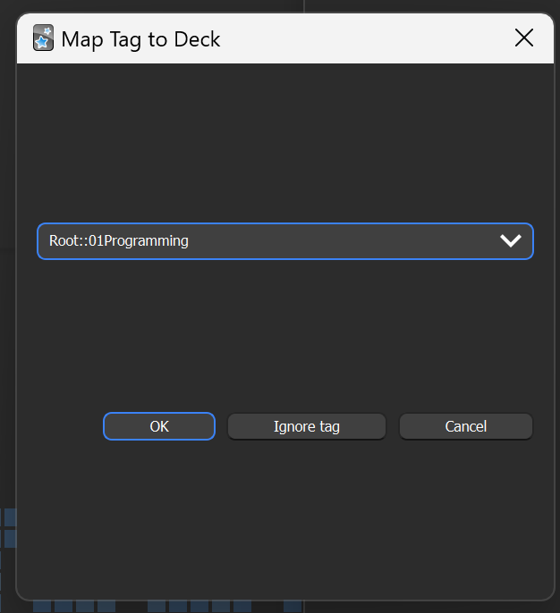
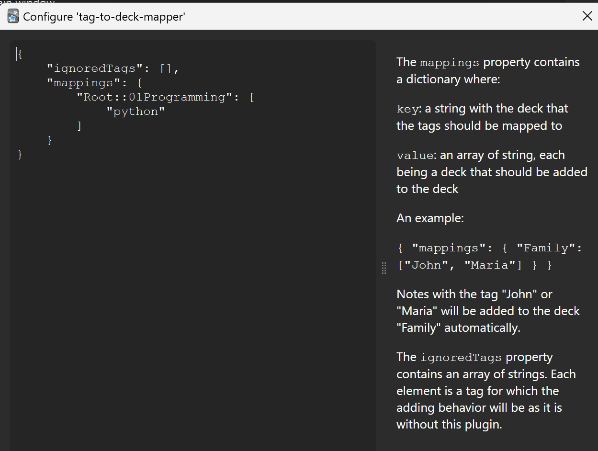

# Anki Tag to Deck Mapper

## Summary

This plugin allows you to map your tags to your decks automatically when adding a new note.
The mapping is persisted in the configuration of the plugin.

It is also possible to ignore defined tags for this behavior.

## Installation

Can be installed by using the code displayed on the plugin's [AnkiWeb](https://ankiweb.net/shared/info/617676051) page.

## Usage

Whenever you add a new note with a tag that was not encountered before, a dialog asking you to choose a deck for that
particular tag pops up:

Pressing "Ok":
From now on, if another note with the same tag is added, it will always automatically be added to the chosen deck.

Pressing "Ignore tag":
The dialog will not pop up for this particular tag again. The behavior will be as expected without this plugin.

Pressing "Cancel":
The note is added as expected without this plugin, but the dialog will pop up again if a note with the same tag is added
at a later time.

## Configuration

Apart from the dialog, the mappings and ignored tags can also be manipulated through their config.json:

## Limitations

Right now, this plugin does nothing if more than one tag is present on an added note. I am still unsure on how it should
behave in that way.